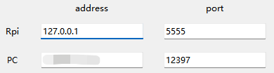

# Local Server Usage Instructions

In certain cases, it is necessary to analyze local videos. We provide the `local_server` method to facilitate this process.

## Steps for Local Video Analysis

### 1. Preparing the Background Image

Before starting the local video analysis, you need to prepare the background image for the scene. The image should be named `background_image.png` and placed in the `client_host/GUI` directory.


### 2. Starting the Local Server

Next, you need to start the local server. Open a command prompt (CMD) and navigate to the root directory of the software. Run the following command:

```bash
python .\local_server\server.py <address> <input_file>
```

- `<address>`: Replace this with your computer's IP address.
- `<input_file>`: Specify the path to the video you want to analyze.


### 3. Launching the Software

After the local server is running, you can start the software. Run the following command to launch the graphical user interface (GUI):

```bash
python client_host/GUI/MainGUI.py
```


### 4. Configuring the GUI for Local Video

In the GUI, enter the local server's address. For local video analysis, set the address to `127.0.0.1` as shown in the image below:




### 5. Adjusting Video Settings

Once the GUI is open, make sure to configure the video resolution and frame rate settings within the software. Ensure these settings match the background image and the video file's resolution and frame rate.


### 6. Running Local Video Analysis

With the above steps completed, you are ready to analyze the local video. The software will process the video and allow you to utilize the features provided by the system.

